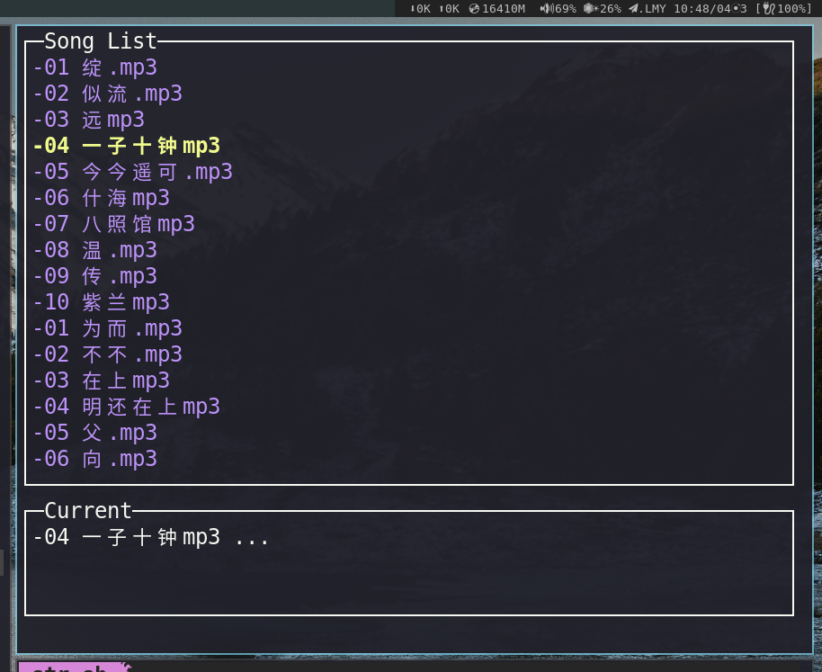

## introduction 
> golang music player


## run
> bash run.sh

### pprof
> bash run.sh env=dev


## global keyboard shortcuts
```sh
./goplayer.sh -next
./goplayer.sh -pause
# 其它待完善....
```


## dependent
### audio
> github.com/faiface/beep

## ui
> github.com/jroimartin/gocui


## heighten
> ffmpeg convert ape,wav,wma to mp3


